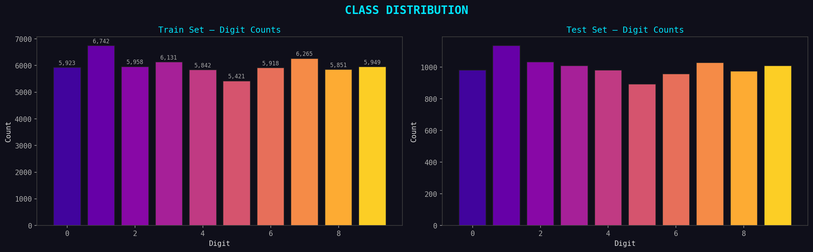
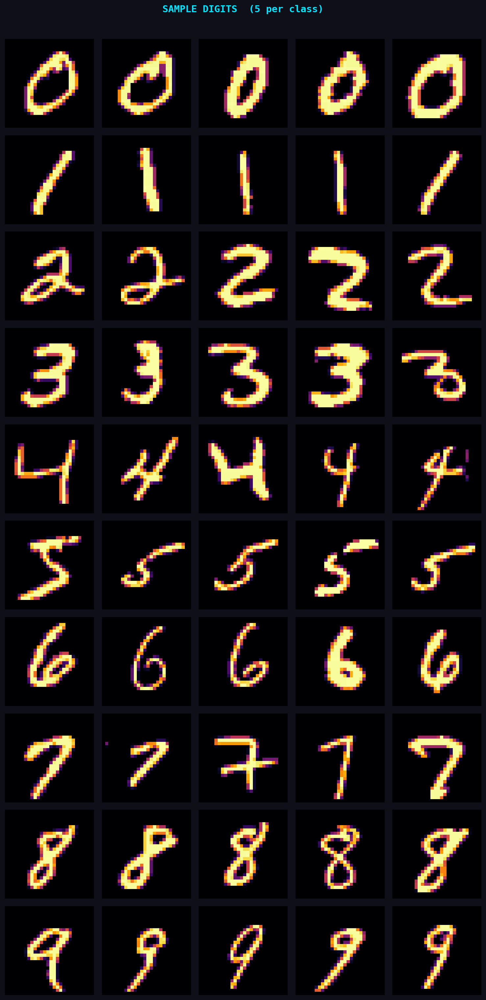
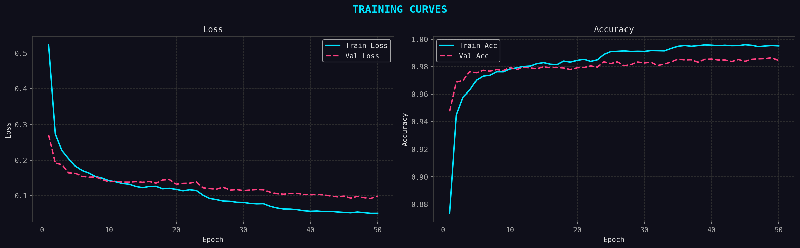
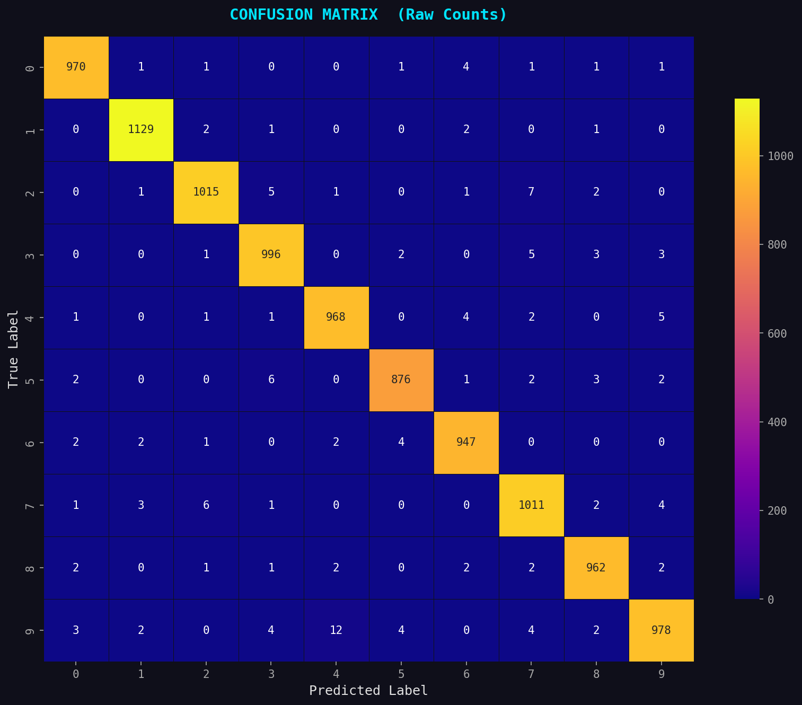
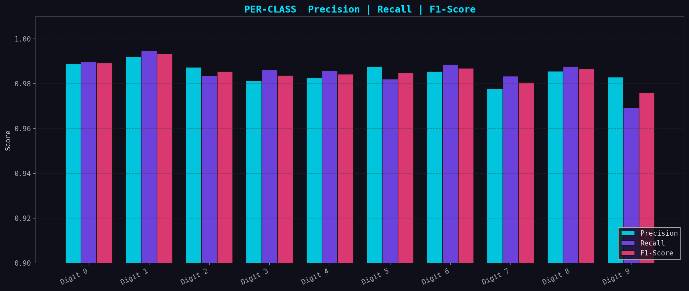
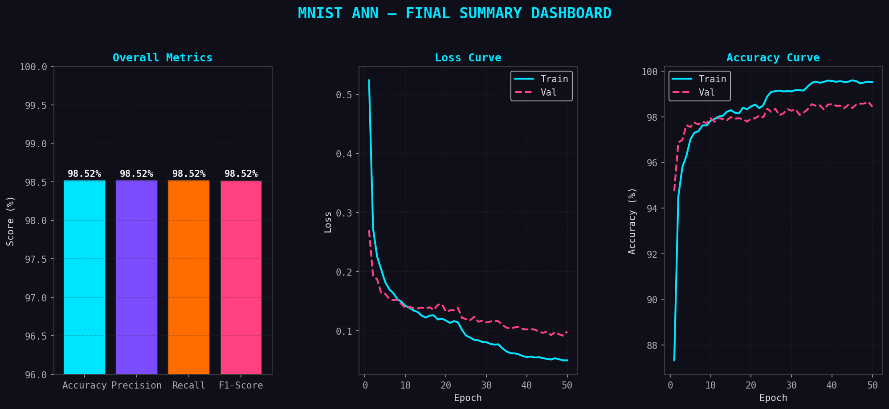

# ✍️ Handwritten Digit Recognition — ANN on MNIST

> Artificial Neural Network trained on the MNIST dataset to classify handwritten digits (0–9) with **98.52% test accuracy**.

---

## 📊 Results

| Metric | Score |
|--------|-------|
| Accuracy | **98.52%** |
| Precision | **98.52%** |
| Recall | **98.52%** |
| F1-Score | **98.52%** |
| Test Loss | 0.0945 |

---

## 🗂️ Project Structure

```
Hand_Written_Digit_Recognition/
├── Figures/                        # All 15 output plots
│   ├── 01_class_distribution.png
│   ├── 02_sample_digits.png
│   ├── 03_pixel_intensity.png
│   ├── 04_mean_images.png
│   ├── 05_variance_map.png
│   ├── 06_normalisation.png
│   ├── 07_ann_architecture.png
│   ├── 08_training_curves.png
│   ├── 09_confusion_matrix.png
│   ├── 10_confusion_matrix_norm.png
│   ├── 11_per_class_metrics.png
│   ├── 12_correct_predictions.png
│   ├── 13_wrong_predictions.png
│   ├── 14_confidence_distribution.png
│   └── 15_summary_dashboard.png
├── Model/
│   └── mnist_ann_model.h5          # Saved trained model
└── Hand_Written_Digit_Recognition.ipynb
```

---

## 🧠 Model Architecture

```
Input (784)  →  Dense 512 → BN → ReLU → Dropout 0.4
             →  Dense 256 → BN → ReLU → Dropout 0.3
             →  Dense 128 → BN → ReLU → Dropout 0.2
             →  Output 10 → Softmax
```

Total parameters: **571,018** · Optimizer: Adam · Loss: Categorical Crossentropy

---

## 📈 Visualisations

| | |
|---|---|
|  |  |
|  |  |
|  |  |

---

## ⚙️ Setup & Run

This notebook is designed for **Kaggle**. To run it:

1. Open a new Kaggle notebook
2. Add dataset → search **`mnist-in-csv`** by *oddrationale*
3. Upload and run `hand-written-digit-recognition.ipynb`

**Dependencies** (pre-installed on Kaggle):
```
tensorflow  scikit-learn  numpy  pandas  matplotlib  seaborn
```

---

## 📋 Key Steps

- **EDA** — class distribution, sample images, pixel intensity, mean/variance maps
- **Normalisation** — pixel values scaled from [0, 255] → [0.0, 1.0]
- **Training** — EarlyStopping (patience=7) + ReduceLROnPlateau; 10% validation split
- **Evaluation** — confusion matrix, per-class metrics, confidence distribution, sample predictions

---

## 📁 Dataset

[MNIST in CSV](https://www.kaggle.com/datasets/oddrationale/mnist-in-csv) — 60,000 training + 10,000 test samples, 28×28 grayscale images of handwritten digits.

---

## 🪪 License

MIT
